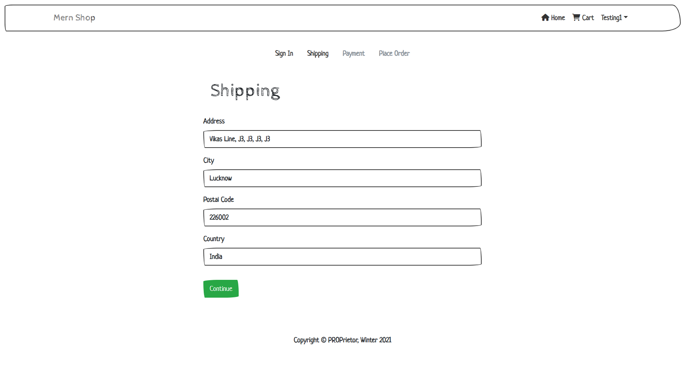
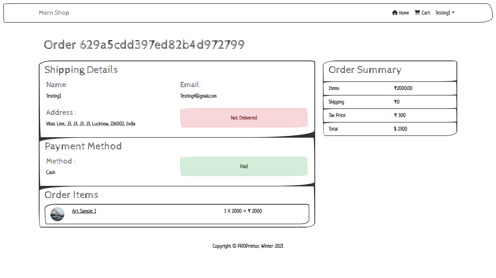

# Devmeet

https://prop-shop.onrender.com/

> This is a singler seller e-commerce platform where people can sell their products and increase their online presence, a MERN stack application that includes authentication, profiles and reviews, buy, sell, last orders and admin panel.

---

# Setup

### Make a .env file in root folder with the following

```
PORT=5000
MODE=Development
MONGO_URI=
JWT_SECRET=
```

### Install server dependencies

```bash
npm install
```

### Install frontend dependencies

```bash
cd frontend
npm install
```

### Run both Express & React from root

```bash
npm run dev
```

### Build for production

```bash
cd client
npm run build
```

---

## Screenshort of the Project


<br>

<br>

<br>

<br>

<br>

<br>

<br>
